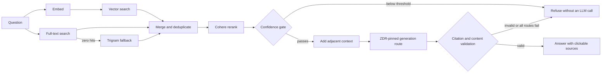

# Truenote

[](https://github.com/ryanportfolio/kbase/actions/workflows/security.yml)

[Website](https://truenote.org/)

**A citation-first RAG system for support teams that need an answer they can verify before continuing the call.**

Truenote turns SOPs, policy documents, screenshots, and tables into a controlled knowledge base. Customer service representatives ask a question and receive a grounded answer with clickable source excerpts. If the evidence is weak or the answer fails citation checks, Truenote refuses instead of guessing.


## Why Truenote

Most RAG demos stop when an answer sounds plausible. Truenote is built around the next question a representative has to answer: **Can I trust this enough to say it to a customer?**

| Need | What Truenote does |
|---|---|
| Find exact policy terms and natural-language matches | Runs vector and PostgreSQL full-text search in parallel, then uses trigram search for keyword zero-hits and Cohere to rerank the merged candidates. |
| Keep unsupported answers off the screen | Refuses before generation when retrieval confidence is too low. Generated answers must cite known retrieved chunks or they are rejected. |
| Prevent cross-program retrieval | Filters every retrieval query by server-resolved `program_id` and classification, then applies a final fail-closed scope check. |
| Preserve context across chunk boundaries | Adds adjacent chunks for the strongest reranked anchors without letting those unscored neighbors affect the confidence gate. |
| Catch bad source material before it goes live | Holds uploads through file checks, malware scanning, content DLP, parsing, preview, and separate approval. |
| Measure quality instead of judging a demo | Attributes failures to retrieval, reranking, thresholding, or generation, with optional claim-level faithfulness judging. |

## Retrieval and answer pipeline



Vector, full-text, trigram, neighbor, citation, and history reads are scoped in SQL to the authenticated user's program and clearance. Conversation history may help rewrite a follow-up into a standalone question, but it is not factual evidence for the answer.

## Security work

Security is part of Truenote's data path, not a separate checklist. The repository includes controls for authorization, controlled ingestion, model input and output, audit delivery, browser requests, dependency review, and recovery-oriented retention.

| Area | Repository state | What still needs deployment evidence |
|---|---|---|
| Program and classification isolation | Implemented with SQL filters, server-resolved scope, defense-in-depth filtering, and negative tests. | Confirm deployed roles, clearances, and data assignments. |
| Grounded generation | Implemented with a retrieval gate, untrusted-excerpt instructions, citation validation, sensitive-output blocking, and defensive refusal. | Run the eval set against the deployed corpus and approved providers. |
| Controlled ingestion | File signatures, EICAR checks, fail-closed scanner handling, content DLP, inactive versions, separate approval, revocation, and retention gates exist in code and DDL. | Configure and test an approved malware scanner. Review legacy content and source ownership. |
| Authentication and browser defense | Argon2id local passwords, hashed session tokens, OIDC Authorization Code with PKCE, MFA or ACR validation, CSP, Origin checks, and Fetch Metadata checks exist in code and tests. | Configure the IdP, test MFA claims and break-glass access, then smoke-test browser headers after deployment. |
| Audit and SIEM | Hash-chained security events, a transactional outbox, signed delivery, bounded retries, lease fencing, dead-letter state, and health reporting are included. | Apply the outbox DDL, configure the receiver and signing key, and retain outage and recovery receipts. |
| Supply chain | Pull requests and `main` run type checks, unit tests, a high-severity production dependency audit, CycloneDX SBOM generation, Gitleaks, and CodeQL security-extended analysis. Dependabot checks npm and GitHub Actions weekly. | Confirm branch protection requires the workflow and retain the evidence your policy requires. |

These are implementation and evidence claims, not a certification claim. Truenote is **not represented as FedRAMP compliant, FedRAMP-ready, production secure, or fully controlled in every deployment**. Provider settings, deployed configuration, operating procedures, retained evidence, and independent assessment remain separate obligations.

Read the [security documentation index](./docs/security/README.md), the [technical security capabilities brief](./docs/security/truenote-security-capabilities.html), and the [dated P0/P1 posture review](./docs/security/truenote-p0-p1-security-review.html). Report vulnerabilities through [SECURITY.md](./SECURITY.md).

## Product tour

### For representatives

- Answers render as Markdown with inline citation chips. A chip opens the exact source excerpt and document version.
- Follow-up questions are rewritten into standalone retrieval queries. Prior answers are not reused as evidence.
- A clear "Not in knowledge base" state can be flagged for content owners.
- Keyboard shortcuts keep the ask, read, cite, and return loop fast during a call.
- Feedback and refusals feed a program-scoped content-gap queue.

### For knowledge owners

- Upload PDF, DOCX, PNG, JPG, WebP, Markdown, or text sources.
- Review provenance, scan findings, classification, parsed content, and chunk boundaries before activation.
- Keep immutable document versions. Re-uploading creates a new inactive version instead of overwriting history.
- Approve content through a separate senior reviewer. Uploaders cannot approve their own version.
- Inspect retrieval confidence, rerank scores, provider attempts, latency, evaluation history, and redacted application errors.

## Ingestion pipeline

Each document version moves through a controlled, asynchronous pipeline:

1. Store the original bytes and SHA-256 digest.
2. Validate the file signature and check for EICAR.
3. Send raw bytes to the configured malware scanner. Missing or failed scanning quarantines the upload.
4. Parse PDFs and images with LandingAI ADE, DOCX with Mammoth, and text formats directly.
5. Scan parsed content for secrets, private keys, SSNs, payment cards, and prompt-injection markers. Blocking findings quarantine before embedding.
6. Split content near 500 tokens without breaking tables or lists. Add a document and heading path to each chunk.
7. Embed and index clean chunks.
8. Keep the version inactive until a different authorized reviewer approves it.

## Evaluation

The eval harness runs the retrieval and generation pipeline against curated in-knowledge-base and out-of-knowledge-base questions. It reports answer accuracy, citation accuracy, false refusals, correct refusals, stage-level failure attribution, and latency. The optional judge breaks answers into claims and checks each claim against the excerpts the model received.

```bash
pnpm --filter @workspace/scripts run eval
pnpm --filter @workspace/scripts run eval -- --limit 5
pnpm --filter @workspace/scripts run eval -- --judge
pnpm --filter @workspace/scripts run eval -- --threshold 0.25
```

The eval commands require a configured database and provider keys. A model or reranker change is not complete until its score distribution and refusal threshold have been evaluated together.

## Stack

| Layer | Choice |
|---|---|
| Frontend | React 18, Vite, Tailwind CSS, Wouter |
| API and workers | Express, TypeScript, pg-boss |
| Database | PostgreSQL with `pgvector`, `pg_trgm`, and Drizzle bindings |
| Parsing | LandingAI ADE Parse v2, Mammoth for DOCX |
| Embeddings | OpenAI `text-embedding-3-small` |
| Retrieval | Vector search, PostgreSQL full-text search, trigram fallback, Cohere reranking |
| Generation | Administrator-ordered, server-allowlisted OpenRouter routes with one pinned ZDR provider per request |
| Hosting | Replit with Neon-backed PostgreSQL and object storage |

Answer generation does not fall back to a direct provider outside the enforced OpenRouter route policy. Direct OpenAI embeddings and the optional eval judge are separate data flows and need their own organization-level retention controls. LandingAI ZDR is also an account setting, not a request flag.

## Repository layout

```text
artifacts/
  rag-app/        React application for representative and admin workflows
  api-server/     Express API, auth, retrieval, ingestion, and security controls
lib/
  db/             Shared Drizzle schema bindings and database client
scripts/          Evaluation, seeding, re-ingestion, and maintenance workers
docs/security/    Control DDL, evidence briefs, and the dated posture review
PRODUCT.md        Product users, principles, and boundaries
DESIGN.md         Interface tokens, components, motion, and accessibility rules
```

## Run locally

### Prerequisites

- Node.js 22 or newer
- pnpm 10 through Corepack
- PostgreSQL with the `vector`, `pg_trgm`, and `pgcrypto` extensions
- Provider credentials listed in [`.env.example`](./.env.example)

The current database is managed with reviewed SQL and PostgreSQL state, not `drizzle-kit`. This repository does not yet provide one-command local database provisioning. Start with the schema handoff in [`REPLIT_HANDOFF.md`](./REPLIT_HANDOFF.md) and the security DDL under [`docs/security/`](./docs/security/).

Install locked dependencies and create a local environment file:

```bash
corepack enable
pnpm install --frozen-lockfile
cp .env.example .env
```

On PowerShell, use `Copy-Item .env.example .env`. For local development, set `PORT=5173` and `API_PORT=5000`; the checked-in example uses the Replit port arrangement.

Run the API and frontend in separate terminals:

```bash
pnpm dev:api
```

```bash
pnpm dev:web
```

Run `pnpm worker` in a third terminal for ingestion and background evaluation jobs.

## Verify a change

```bash
pnpm check
pnpm test
```

Changes to ingestion, retrieval, reranking, generation, or citation behavior also require the eval suite against a representative fixture or deployed test corpus. Runtime integrations such as OIDC, malware scanning, SIEM delivery, storage, and provider retention settings need tests in the environment where they are configured.

## Contributing

Read [CONTRIBUTING.md](./CONTRIBUTING.md) before opening a pull request. The short version: keep every representative-facing answer cited or refused, preserve server-side scope enforcement, add negative tests for boundary changes, and run the checks that match the area you changed.

## License

This repository does not currently include an open-source license. Public visibility alone does not grant permission to copy, modify, or distribute the code. A license should be selected before inviting external reuse or contributions.
