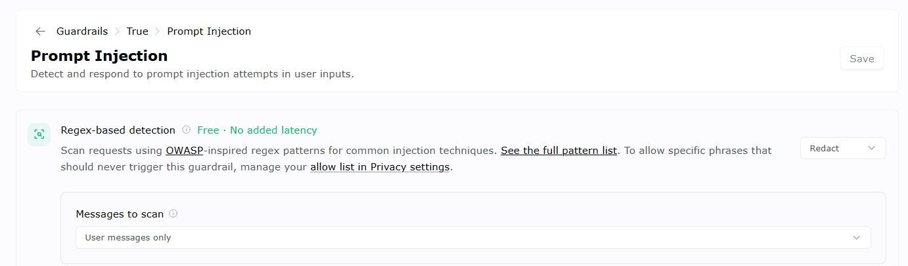
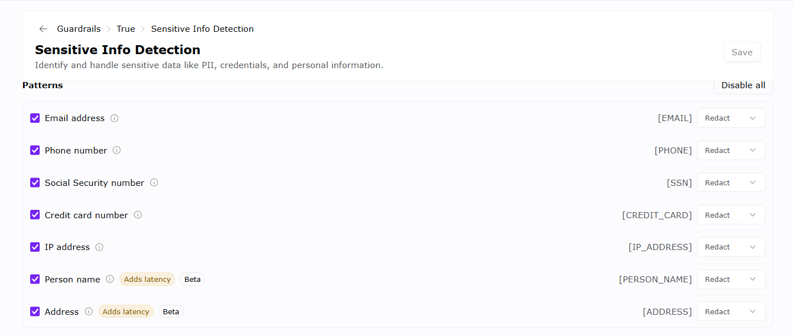

# OpenRouter guardrail evidence record

**Recorded:** 2026-07-16  
**Evidence source:** Configuration screenshots supplied by the Truenote owner  
**Evidence grade:** Implemented, unverified

## Preserved evidence inventory

The original clipboard images have been copied into this repository so the
evidence does not depend on a temporary local path. The hashes below bind this
record to the exact supplied bytes.

| Evidence file | SHA-256 | Visible configuration |
|---|---|---|
| [`evidence/openrouter-prompt-injection-guardrail-2026-07-16.png`](./evidence/openrouter-prompt-injection-guardrail-2026-07-16.png) | `F91D1AB3B56FFF6F06C62B7CF0E4148F469B9A4FFDF23A870FDF2A5D456D98D8` | Guardrail `True`; prompt-injection regex detection; `Redact`; user messages only |
| [`evidence/openrouter-sensitive-info-detection-2026-07-16.png`](./evidence/openrouter-sensitive-info-detection-2026-07-16.png) | `FDCD3FA6257794940FBBB55D99357A4D659AB70DBC10B0062AB6A40EED94F73C` | Email, phone, SSN, credit card, IP, person name, and address enabled with `Redact`; name and address marked beta/latency-adding |

## Configuration represented by the supplied evidence

The screenshots show an OpenRouter guardrail named `True` with these controls:

- prompt-injection detection for user messages using the regex-based detector,
  with the response set to redact; and
- sensitive-information detection set to redact email addresses, phone numbers,
  Social Security numbers, credit-card numbers, IP addresses, person names, and
  street addresses.

This is material evidence that real-time input redaction has been configured for
requests to which this OpenRouter guardrail is assigned. It directly rebuts a
blanket statement that Truenote has no PII-redaction control.

## What this evidence does not establish

The screenshots do not prove:

- that the guardrail is assigned to every production OpenRouter request or API
  key used by Truenote;
- the configuration version, effective time, change history, or fail-open/fail-
  closed behavior;
- that test PII is actually replaced before a model/provider receives it;
- output-side sensitive-data detection;
- contextual name/address protection on direct-provider paths; local deterministic
  email/structured-phone/IP/SSN/PAN/secret protection is now implemented before
  OpenAI embeddings and Cohere reranking but remains runtime-unverified;
- protection of requests sent to LandingAI or any future provider not wired
  through the local text firewall; or
- protection of uploaded files before LandingAI parsing or before local DLP runs.

Accordingly, the defensible current claim is: **OpenRouter input redaction is
configured for the represented guardrail; complete production assignment and
runtime effectiveness remain to be verified.**

## Runtime acceptance procedure

Use synthetic data only. Do not use a real card number, SSN, customer prompt, or
production document.

1. Export or capture the active guardrail assignment for every Truenote
   production OpenRouter key/project and record the date and reviewer.
2. Send a controlled test request through the same Truenote production code path
   using synthetic values for each enabled sensitive-data category.
3. Retain a sanitized gateway/provider receipt showing the downstream request
   contains the expected placeholders rather than the synthetic source values.
4. Test a prompt-injection string and record the actual redact/block result.
5. Test an unavailable or failed guardrail dependency and record whether the
   application fails closed, blocks, queues, or continues without redaction.
6. Record false-positive and false-negative tests, including names and addresses
   because those detectors are marked beta and add latency in the supplied UI.
7. Repeat after material configuration/provider changes and at the approved
   control-review interval.

## Required retained fields

- environment and Truenote release/commit;
- OpenRouter project/key identifier in non-secret form;
- guardrail/configuration identifier and version or export;
- test timestamp, reviewer, synthetic cases, expected and actual result;
- sanitized downstream receipt or provider-side trace;
- failures, owner, disposition, retest, and next review date.
